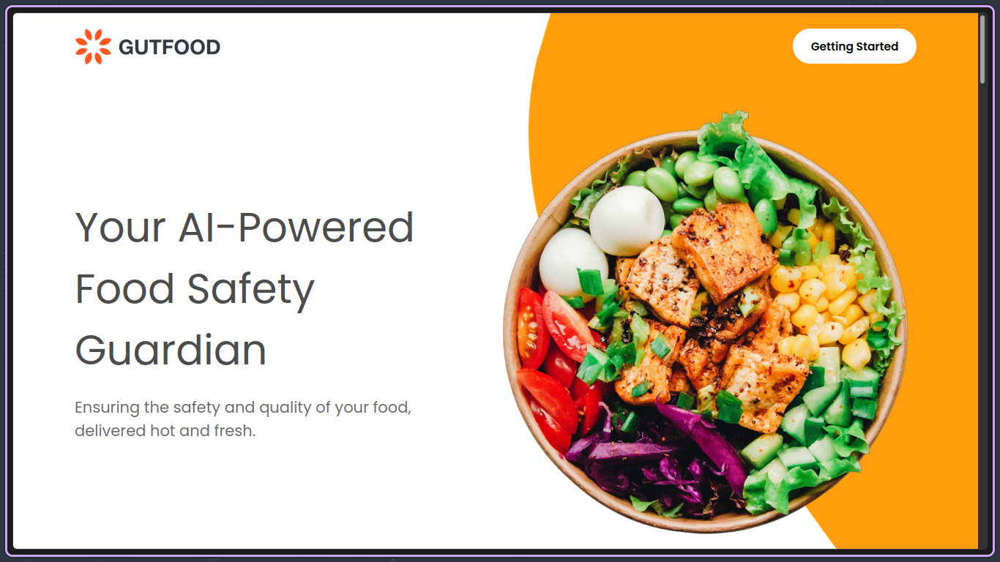
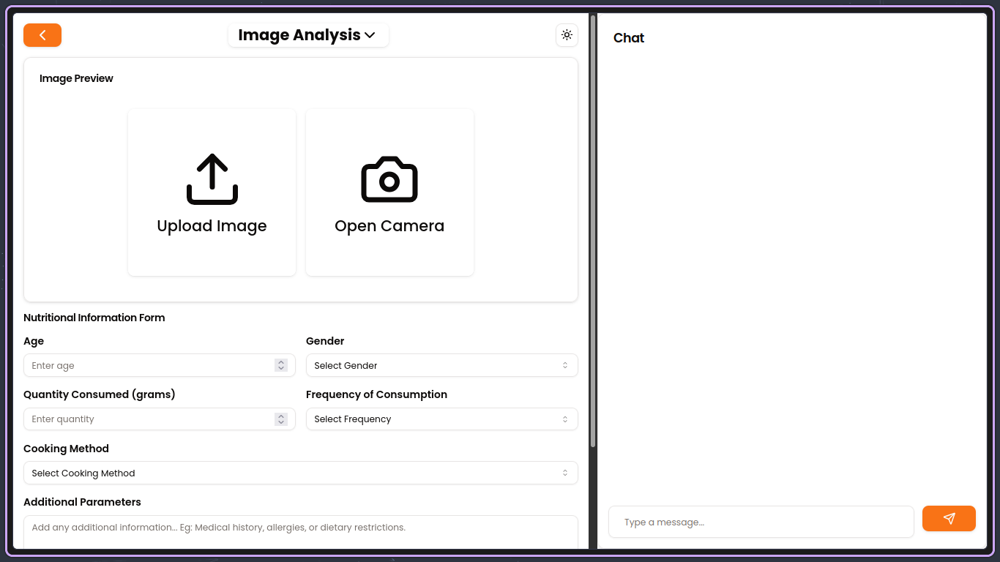
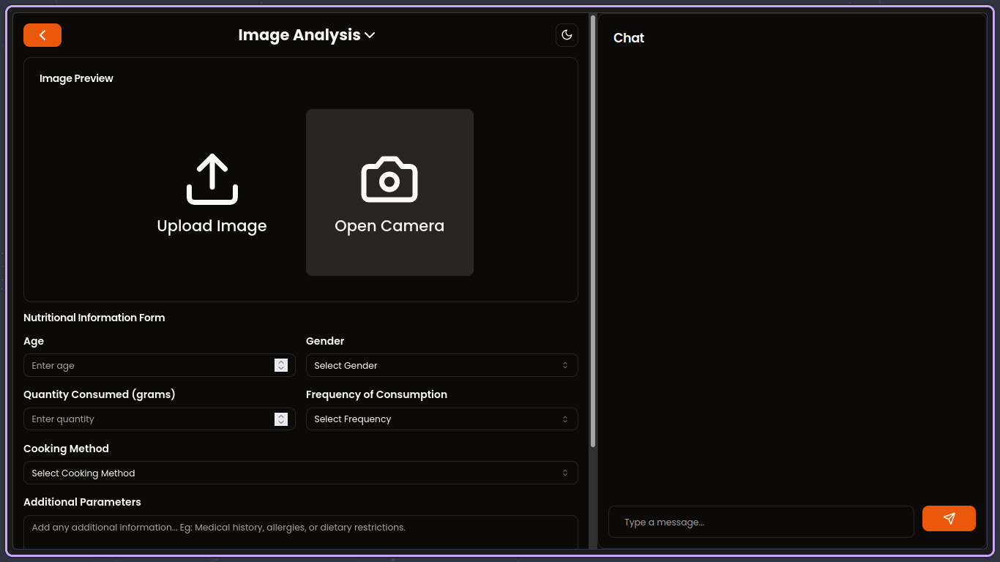
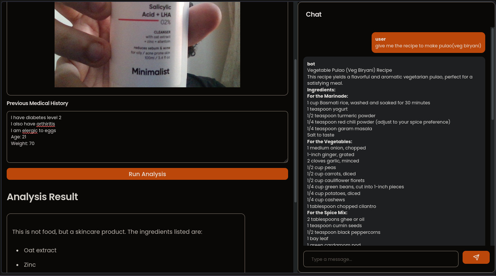

# GutFood


## Collaborators

- [Badal Singh](https://github.com/BadalSingh2)
- [Ronit Naik](https://github.com/RonitNaik122)
- [Pratyay Koley](https://github.com/PratyayKoley)

GutFood is a web application that provides food insights from images, including health risks, recipes, and ingredients. It leverages advanced technologies to offer a comprehensive food analysis platform.

## Features

- **Image Analysis**: Get detailed insights about food from uploaded images.
- **Health Risk Assessment**: Evaluate potential health risks associated with food items.
- **Recipe Suggestions**: Discover recipes based on analyzed food images.
- **Ingredient Breakdown**: Get a detailed list of ingredients for analyzed food items.
- **Disease Prediction**: Utilize custom ML models for disease prediction based on food habits.
- **Interactive Chatbot**: Engage with an AI-powered chatbot for additional food-related insights.

## Tech Stack

### Backend
- Django
- Google Gemini for information retrieval
- Custom ML models (joblib and pickle) for disease prediction

### Frontend
- React
- Framer Motion
- Material-UI
- Tailwind CSS
- Shadcn UI
- Chart.js for data visualization

## Installation

### Backend

```bash
# Clone the repository
git clone https://github.com/your-username/gutfood.git
cd gutfood/backend

# Create a virtual environment
python -m venv venv
source venv/bin/activate  # On Windows, use `venv\Scripts\activate`

# Install dependencies
pip install -e .

# Run migrations
python manage.py migrate

# Start the Django server
python manage.py runserver
```

### Frontend

```bash
# Navigate to the frontend directory
cd ../frontend

# Install dependencies
npm install

# Start the development server
npm run dev
```

## Usage

1. Open your browser and navigate to `http://localhost:5173` (or the port specified by Vite).
2. Upload a food image to get insights.
3. Explore the various features like health risk assessment, recipe suggestions, and more.
4. Interact with the chatbot for additional information.

## Screenshots


*Homepage of GutFood*


*Webapp main page*



*Dark mode if only*


*Food Image Analysis Results*

## License

This project is licensed under the MIT License - see the [LICENSE](LICENSE) file for details.
